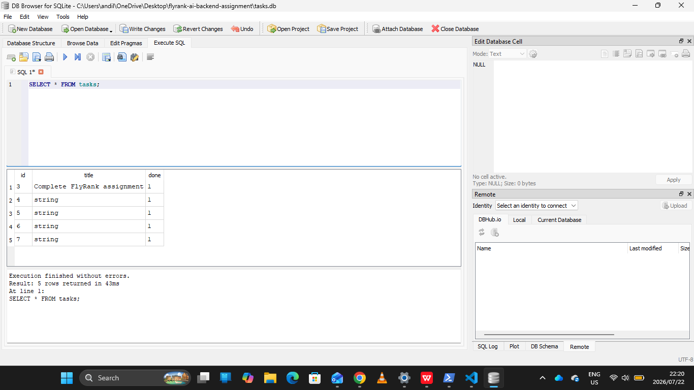

# FlyRank AI Backend Assignment

## Overview

This project is a simple Task Management API built using **FastAPI** and **SQLite**.

The purpose of this project is to demonstrate how a CRUD (Create, Read, Update, Delete) API can use a real SQLite database instead of an in-memory list. All task data is stored in a SQLite database, allowing data to persist even after the server is restarted.

---

## Technologies Used

- Python
- FastAPI
- SQLite
- Pydantic
- Uvicorn

---

## Why SQLite?

SQLite was chosen because it is lightweight, easy to use, and requires no separate database server. It stores all data in a single database file (`tasks.db`), making it an excellent choice for small backend applications and learning SQL.

---

## Database Location

The SQLite database file is stored in the project root as:

```
tasks.db
```

When the application starts, it automatically:

- Creates the database if it does not exist.
- Creates the `tasks` table if it does not exist.
- Inserts three example tasks only if the table is empty.

---

## API Endpoints

| Method | Endpoint | Description |
|--------|----------|-------------|
| GET | `/` | Returns a welcome message |
| GET | `/health` | Checks if the API is running |
| GET | `/tasks` | Returns all tasks |
| GET | `/tasks/{task_id}` | Returns a single task |
| POST | `/tasks` | Creates a new task |
| PUT | `/tasks/{task_id}` | Updates an existing task |
| DELETE | `/tasks/{task_id}` | Deletes a task |

---

## How to Run the Project

### 1. Clone the repository

```bash
git clone https://github.com/Andile1-tech/flyrank-ai-backend-assignment
```

### 2. Open the project folder

```bash
cd https://github.com/Andile1-tech/flyrank-ai-backend-assignment
```

### 3. Install the dependencies

```bash
pip install -r requirements.txt
```

### 4. Start the FastAPI server

```bash
uvicorn main:app --reload
```

### 5. Open Swagger UI

```
http://127.0.0.1:8000/docs
```

---

## Example SQL Queries

List all tasks:

```sql
SELECT * FROM tasks;
```

Show completed tasks:

```sql
SELECT * FROM tasks WHERE done = 1;
```

Count all tasks:

```sql
SELECT COUNT(*) FROM tasks;
```

Update every task as completed:

```sql
UPDATE tasks SET done = 1;
```

Delete all completed tasks:

```sql
DELETE FROM tasks WHERE done = 1;
```

---

## Database Screenshot



The screenshot above shows the SQLite database (`tasks.db`) opened using **DB Browser for SQLite**.

---

## Project Structure

```text
project/
│
├── docs/
│   └── database.png
│
├── repository/
│   └── sqlite_repository.py
│
├── main.py
├── database.py
├── tasks.db
├── README.md
├── requirements.txt
└── .gitignore
```

---

## Features

- SQLite database integration
- Automatic database creation
- Automatic table creation
- Seed data inserted only once
- Persistent storage
- Full CRUD API
- SQL queries for Create, Read, Update and Delete
- Swagger API documentation

---

## Assignment Requirements Completed

- ✅ SQLite database replaces the in-memory list
- ✅ Data persists after restarting the server
- ✅ Database created automatically
- ✅ Tasks table created automatically
- ✅ Three sample tasks inserted only on first run
- ✅ CRUD operations use SQL queries
- ✅ GET, POST, PUT and DELETE endpoints implemented
- ✅ Invalid requests return appropriate HTTP status codes
- ✅ SQL queries tested using DB Browser for SQLite
- ✅ Project documented with README and database screenshot

---

## Author

**Atenkosi Mnikina**

Backend AI Engineering Assignment – FlyRank AI